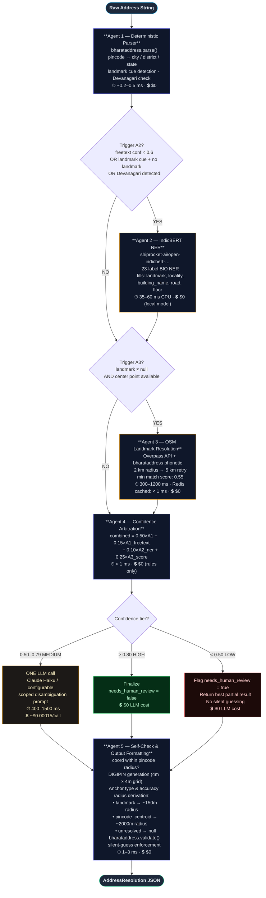
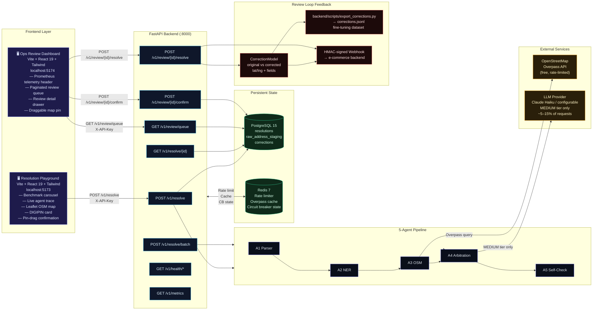
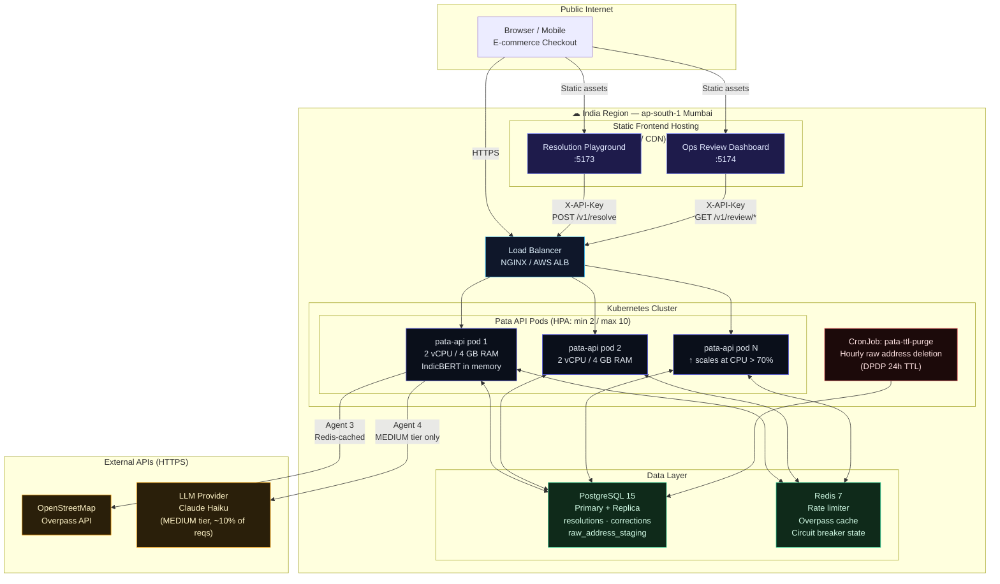

# Pata — Architecture Diagrams

Three focused diagrams. Each is readable at slide dimensions (16:9).  
Source of truth for all agent names, trigger conditions, costs and thresholds is [`PIPELINE.md`](../PIPELINE.md).

---

## Diagram 1 — 5-Agent Pipeline Flow

The selective, cost-aware routing logic. Most addresses never touch the LLM.

**Reading guide:**
- **Purple border** = always-runs agents (A1, A4, A5)
- **Amber border** = selective agents triggered by condition (A2, A3)
- **Green → Amber → Red** = confidence tier routing
- 85–95% of traffic exits at HIGH (zero LLM cost)

---

## Diagram 2 — Full-Stack System View

Both frontends, the API layer, the 5-agent pipeline, external services, and the review-loop feedback path.

---

## Diagram 3 — Deployment Topology

Kubernetes pods, shared state, and data-residency note.

**Deployment notes:**
- All three data stores (Postgres, Redis, raw_address_staging) must remain in the India region per DPDP Act 2023.
- IndicBERT NER model (~125 MB) is loaded into pod memory at startup via `preload_models()` — no external inference endpoint.
- The Overpass cache (Redis, TTL 24h) means most Agent 3 calls cost < 1ms after warm-up.
- HPA scales on CPU; sale event spike config is in `k8s/hpa.yaml` (4 pods/60s scale-up, 5-min scale-down stabilization).

---

*Last updated: Stage 6 (August 2026). Mermaid renders natively on GitHub.*
